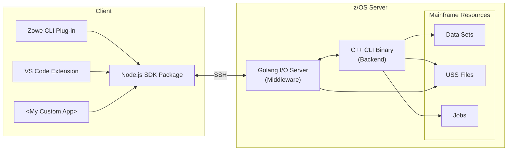

# zowe-native-proto

## Setup

Run `npm install` to install project dependencies.

In the `tools/build` folder, create your own `config.local.json` adjacent to `config.default.jsonc` with something like:

```json
{
  "host": "my.mainframe.net",
  "username": "ibmuser",
  "password": "ibmpass",
  "deployDirectory": "/u/users/ibmuser/zowe-native-proto"
}
```

**Tip:** You can use a `privateKey` instead of `password` in the config.

## Deploy & Build

### z/OS

- `npm run tools:build` - build local tool to manage z/OS builds (only needed once)
- `npm run tools:init` - create project folder structure on z/OS (only needed once)
- `npm run tools:deploy` - deploy source files to z/OS
  - **Tip:** You can deploy just one file or directory like this: `npm run tools:deploy c/zowex.cpp`
- `npm run tools:build` - build native binaries on z/OS
  - **Tip:** You can deploy and build at the same time with `npm run tools:deploy:build`

## Client

- `npm run tools:artifacts` - download binaries to package with clients
- `npm run build` - build all projects in the `packages` folder
  - **Tip:** You can run incremental builds with `npm run watch`
- `npm run package` - create CLI and VSCE artifacts in `dist` folder

## Test

### z/OS

On z/OS system, `cd` to C deploy dir and run `zowex` to invoke the C++ CLI binary or `test.sh` to test a number of commands.

To test I/O server, `cd` to Go deploy dir and run `ioserver`, then type a JSON command like `{"command":"listFiles","fspath":"/tmp"}` and press Enter.

### Client

To install the CLI plug-in from source, run `zowe plugins install ./packages/cli`. To run the VS Code extension, launch the debug task in VS Code.

The `dist` folder contains artifacts that can be shared: a TGZ for CLI plug-in and VSIX for VS Code extension.

## Architecture

Click on a component in the diagram below to learn more about it:



## Troubleshooting

### go: FSUM7351 not found

Ensure go is part of PATH

### Client connection error - Error: All configured authentication methods failed

Check that your username and password are correct.<br/>
For private keys, confirm that you can ssh into the LPAR/zVDT using it.

### FSUM9383 Configuration file `/etc/startup.mk' not found

You should be able to find the startup.mk file in `/samples`

- `cp /samples/startup.mk /etc/startup.mk` <br/>
  _source:_ https://www.ibm.com/support/pages/fsum9383-configuration-file-etcstartupmk-not-found

### Building zut.o - FSUM3221 xlc++: Cannot spawn program /usr/lpp/cbclib/xlc/exe/ccndrvr

The only way we (DKelosky) knew how to fix this is via SYSVIEW commands.

:warning: These commands could ruin your system. :warning:

```
linklist
linkdef zowex from current
linklist zowex
add CBC.SCCNCMP
linkact zowex
set asid 1
linkupd *
```

Note 1: You may need to run `linkact zowex` after an IPL.<br/>
Note 2: You may need to replace `*` with your mask character. For example, `linkact zowex =`
