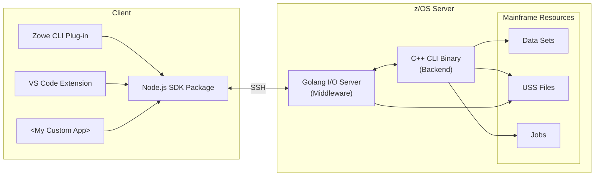

# zowe-native-proto

## Setup

Run `npm install` to install project dependencies.

Create a config file by copying `config.example.yaml` to `config.yaml`. Update the following properties:

- `sshProfile` - Name of Zowe SSH profile used to connect to z/OS
  - If you don't have profiles, run `zowe config init` to create a team configuration file
  - Alternatively, you can define properties inline in the config - see the example YAML below
- `deployDir` - USS directory where source files are uploaded and binaries are built
- `goBuildEnv` (optional) - Environment variables to set for the `go build` command

For a quick start, run `npm run all` to upload source files, build native binaries on z/OS, download build artifacts, and build client packages.

**Tip:** You can define additional profiles in `config.yaml` and use them by setting the environment variable `ZOWE_NATIVE_PROFILE=<profileName>`. For example:

```yaml
another_one:
  sshProfile:
    host: my.mainframe.net
    user: ibmuser
    password: ibmpass
  deployDirectory: /u/users/ibmuser/zowe-native-proto
```

## Deploy & Build

### z/OS

- `npm run z:upload` - deploy source files to z/OS
  - **Tip:** You can deploy just one file or directory like this: `npm run z:upload c/zowex.cpp`
- `npm run z:rebuild` - build native binaries on z/OS
  - **Tip:** You can deploy and build at the same time with `npm run z:build`
- `npm run watch:native` - detect and upload changes to native code

## Client

- `npm run z:artifacts` - download binaries to package with clients
  - **Tip:** You can skip this step by defining `serverPath` property in your SSH profile in `zowe.config.json` to point to a dev build
- `npm run build` - build all projects in the `packages` folder
  - **Tip:** You can run incremental builds with `npm run watch` for client code only, or `npm run watch:all` at the root to watch all code
- `npm run package` - create CLI and VSCE artifacts in `dist` folder

## Test

### z/OS

On z/OS system, `cd` to C deploy dir and run `zowex` to invoke the C++ CLI binary or `test.sh` to test a number of commands.

To test I/O server, `cd` to Go deploy dir and run `zowed`, then type a JSON command like `{"jsonrpc": "2.0", "method": "listFiles", "params": {"fspath": "/tmp"}, "id": 1}` and press Enter.

### Client

To install the CLI plug-in from source, run `zowe plugins install ./packages/cli`. To run the VS Code extension, launch the debug task in VS Code.

The `dist` folder contains artifacts that can be shared: a TGZ for CLI plug-in and VSIX for VS Code extension.

## Architecture

Click on a component in the diagram below to learn more about it:



## Troubleshooting

### go: FSUM7351 not found

Ensure go is part of PATH

### Client connection error - Error: All configured authentication methods failed

Check that your username and password are correct.<br/>
For private keys, confirm that you can ssh into the LPAR/zVDT using it.

### FSUM9383 Configuration file `/etc/startup.mk' not found

You should be able to find the startup.mk file in `/samples`

- `cp /samples/startup.mk /etc/startup.mk` <br/>
  _source:_ https://www.ibm.com/support/pages/fsum9383-configuration-file-etcstartupmk-not-found

### Building zut.o - FSUM3221 xlc++: Cannot spawn program /usr/lpp/cbclib/xlc/exe/ccndrvr

One workaround is to add `CBC.SCCNCMP` to your system LINKLIST concatenation. Below is an example of doing this via SYSVIEW commands.

:warning: These commands could ruin your system. :warning:

```
linklist
linkdef zowex from current
linklist zowex
add CBC.SCCNCMP
linkact zowex
set asid 1
linkupd *
```

Note 1: You may need to run `linkact zowex` after an IPL.<br/>
Note 2: You may need to replace `*` with your mask character. For example, `linkact zowex =`
