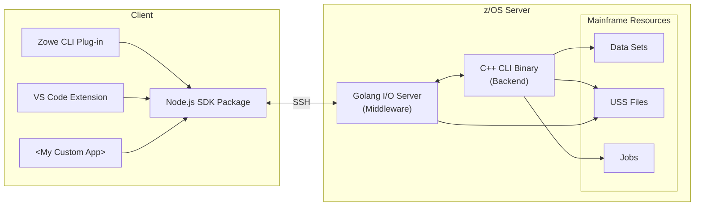

# zowe-native-proto

## Setup

create your own `config.local.json` adjacent to `config.default.json` with something like:

```json
{
    "host": "my.mainframe.net",
    "username": "ibmuser",
    "password": "ibmpass",
    "deployDirectory": "/u/users/ibmuser/zowe-native-proto"
}
```

## Deploy & Build

- `npm run tools:init` (once)
- `npm run tools:deploy [file(s)|dir(s)]`
- `npm run tools:build [file(s)|dir(s)]`
- `npm run tools:deploy:build [file(s)|dir(s)]`
- `npm run tools:artifacts` (to download binaries)

Example: `npm run tools:deploy:build c/zowex.cpp`  to deploy and build one file

## Test

On remote system, `cd` to deploy dir and run `test.sh` (or run `zowex`)

## Troubleshooting

### Client connection error - Error: All configured authentication methods failed

Check that your username and password are correct.<br/>
For private keys, confirm that you can ssh into the LPAR/zVDT using it.

### FSUM9383 Configuration file `/etc/startup.mk' not found

You should be able to find the startup.mk file in `/samples`
  - `cp /samples/startup.mk /etc/startup.mk` <br/>
    _source:_ https://www.ibm.com/support/pages/fsum9383-configuration-file-etcstartupmk-not-found

### Building zut.o - FSUM3221 xlc++: Cannot spawn program /usr/lpp/cbclib/xlc/exe/ccndrvr

The only way we (DKelosky) knew how to fix this is via SYSVIEW commands.

:warning: These commands could ruin your system. :warning:

```
linklist
linkdef zowex from current
linklist zowex
add CBC.SCCNCMP
linkact zowex
set asid 1
linkupd *
```

Note 1: You may need to run `linkact zowex` after an IPL.<br/>
Note 2: You may need to replace `*` with your mask character. For example, `linkact zowex =`

## Architecture

Click on a component in the diagram below to learn more about it:


