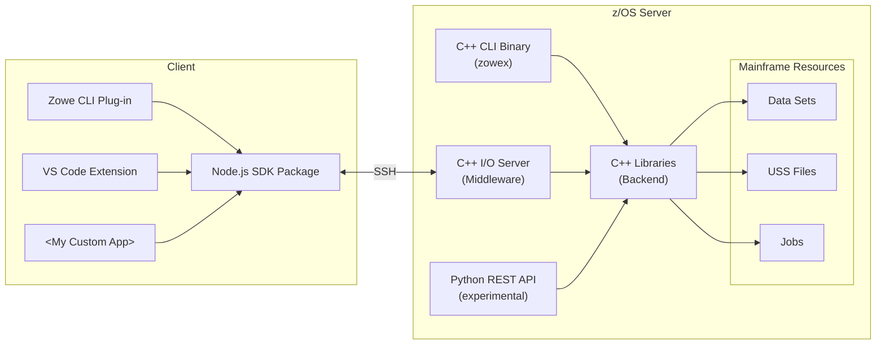

# Zowe Native Protocol

An open-source, native protocol for z/OS mainframe operations via SSH with minimal server-side configuration.

## Prerequisites

### Local

- Node.js & npm - required to build client packages
- VS Code extensions - recommended ones are listed in [extensions.json](./.vscode/extensions.json)

### z/OS

- [IBM C/C++ for z/OS](https://www.ibm.com/products/xl-cpp-compiler-zos) - `xlclang` and `xlclang++`
- [SWIG](https://github.com/t1m0thyj/swig-zos) (optional) - used to build experimental Python bindings

## Setup

1. Clone this repository and run `npm install` to install project dependencies.
2. Create a config file by copying `config.example.yaml` to `config.yaml`. Update the properties in the file for your environment.
3. For a quick start, run `npm run all` which performs the following tasks:
   1. `z:upload` - Upload source files<br/>
   2. `z:build` - Build native binaries on z/OS<br/>
   3. `z:artifacts` - Download build artifacts<br/>
   4. `build` - Build client packages locally

> [!TIP]
> If you don't have a z/OS build environment, you can download prebuilt binaries with `npm run download` (this requires the GitHub CLI). Then skip to Step 3.4 and run `npm run build` to build client packages.

## Usage

### VS Code extension

To run the VS Code extension, open the repository in VS Code and launch the "Run Extension" debug task. Then you can use SSH profiles in Zowe Explorer.

See the [VSCE readme](./packages/vsce/README.md) for more details about using the VS Code extension.

### Zowe CLI plug-in

To install the CLI plug-in from source, run `zowe plugins install ./packages/cli`. Then run `zowe zssh --help` to see available commands.

See the [CLI readme](./packages/cli/README.md) for more details about using the CLI plug-in.

### Native binaries

To run the `zowex` CLI on z/OS, connect to USS shell (OMVS) and `cd` to `c/build-out` inside the deploy directory. Then run `zowex`, or `zoweax` for commands that require APF authorization.

See the [native readme](./native/README.md) for more details about building the native components.

## Development

### Quickstart

Run `npm run z:rebuild` to rebuild server code after editing files in the `native` folder. See [Troubleshooting](./doc/troubleshooting.md) to debug common build issues.

Run `npm run build` to rebuild client code after editing files in the `packages` folder.

To test server changes without having to download artifacts and re-deploy them each time, you can define `serverPath` property in your SSH profile in `zowe.config.json`. It should point to the `<deployDir>/zowed/build-out` folder that contains the `zowed` binary. See example below.

```json
  "profiles": {
    "ssh_dev": {
      "type": "ssh",
      "properties": {
        ...
        "serverPath": "~/zowe-native-proto/zowed/build-out"
      }
    }
  }
```

To package client components with native binaries bundled, run `npm run z:artifacts && npm run package` which generates packages in the `dist` directory.

> [!TIP]
> See the list below for more useful scripts like `watch` for incremental build.

### NPM Scripts

We use a custom build tool for interacting with z/OS that defines the following NPM scripts:

| Command       | Description                                                                 |
| ------------- | --------------------------------------------------------------------------- |
| `z:artifacts` | Download native binaries and package them with clients                      |
| `z:build`     | Run `make` on z/OS to build native binaries                  |
| `z:clean`     | Run `make clean` on z/OS to clean build targets                             |
| `z:delete`    | Delete all files from deploy directory                                      |
| `z:make`      | Execute the specified Make targets on z/OS                                  |
| `z:package`   | Create server PAX artifact in `dist` directory                              |
| `z:rebuild`   | Upload and Build combined in one command                                    |
| `z:test`      | Run automated tests for native components on z/OS                           |
| `z:upload`    | Upload source files from `native` directory to z/OS <sup>1</sup>            |
| `z:watch`     | Detect changes to files in `native` directory and upload/build <sup>2</sup> |

1. To deploy a single file or directory: `npm run z:upload -- c/zowex.cpp`
2. To watch server and client code at the same time: `npm run watch:all`

> [!TIP]
> To deploy and build on a different LPAR, you can define additional profiles in `config.yaml` and use them by changing the `activeProfile` property. For example:
>
> ```yaml
> activeProfile: another
>
> profiles:
>   default:
>     # Profile properties...
>
>   another:
>     sshProfile: ssh2
>     deployDir: /tmp/zowe-native-proto
> ```

## Architecture

Click on a component in the diagram below to learn more about it:


