# Comparing Zowe Native Protocol (ZNP) vs z/OSMF REST API

This document helps illustrate the architectural differences between Zowe Native Protocol (SSH-based) and z/OSMF REST API approaches for mainframe access in Zowe Clients.

## High-Level Architecture

### ZNP

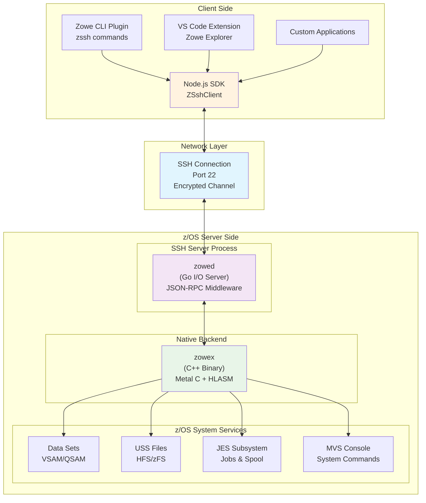

### z/OSMF REST API

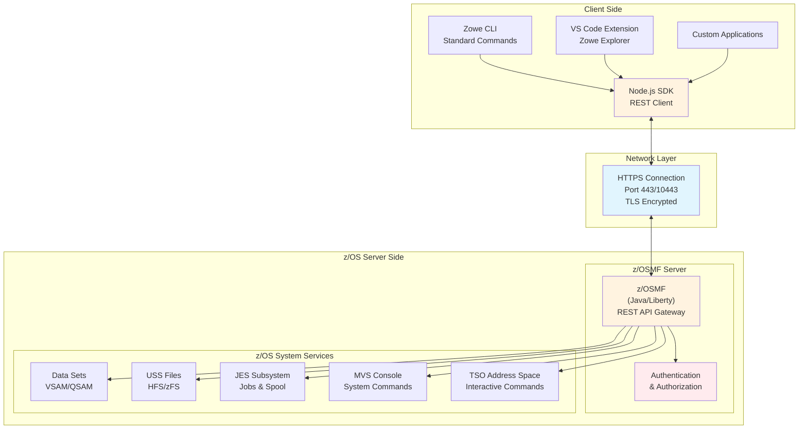

## Request/Response Flow

### ZNP

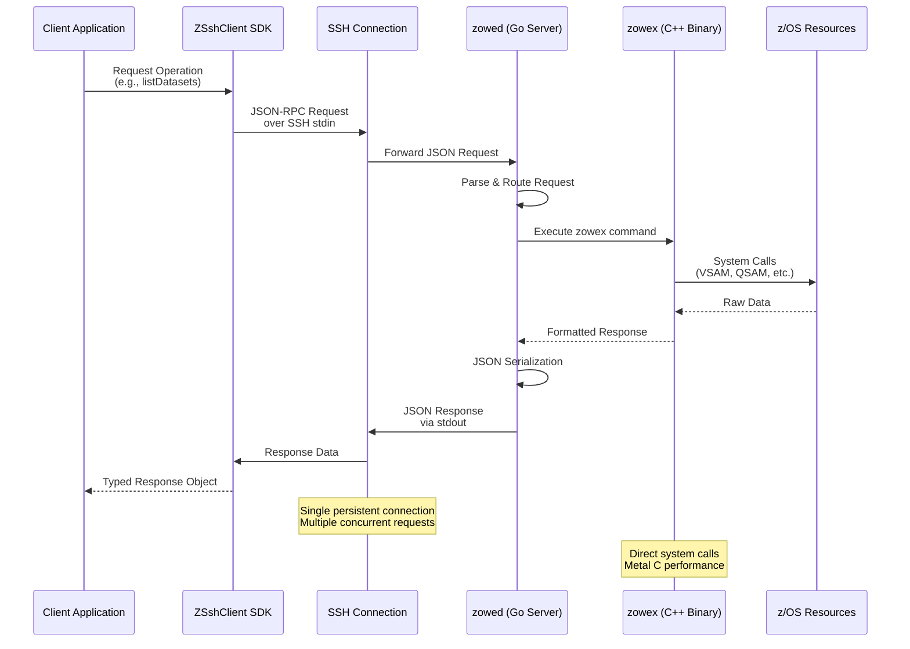

### z/OSMF REST API

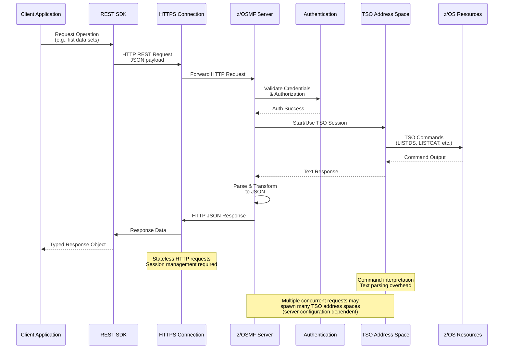

## Component Architecture

### ZNP

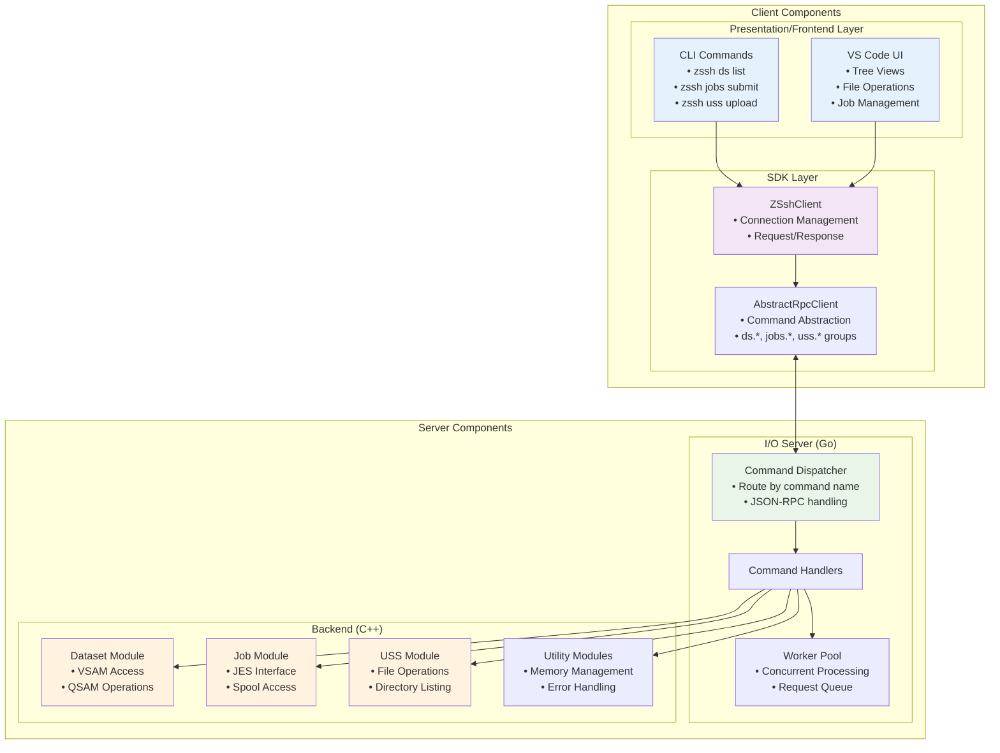

### z/OSMF REST API

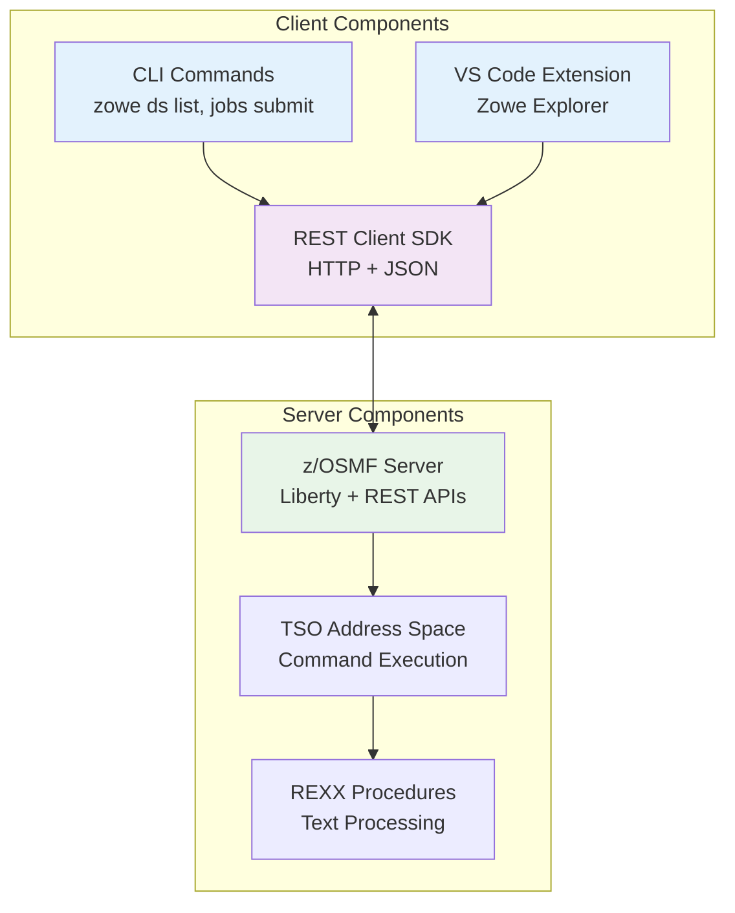

## Performance and Capability

### Connection model

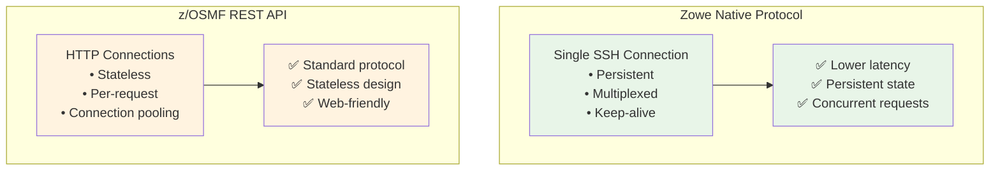

### System resource usage

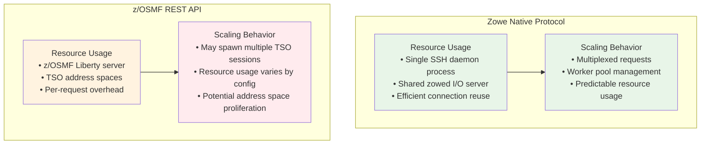

### Data processing

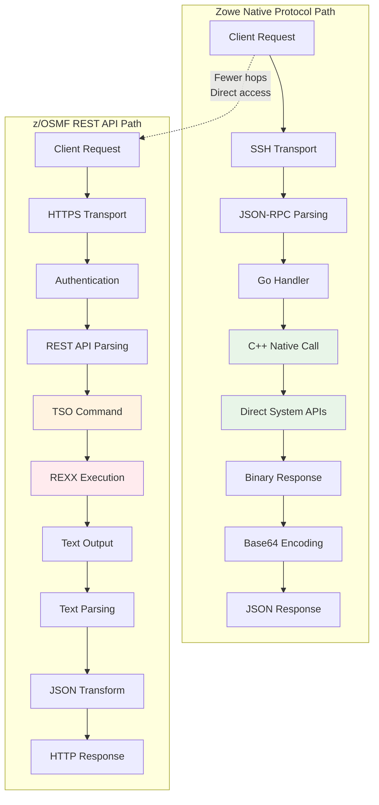

## Security and Access Models

### ZNP

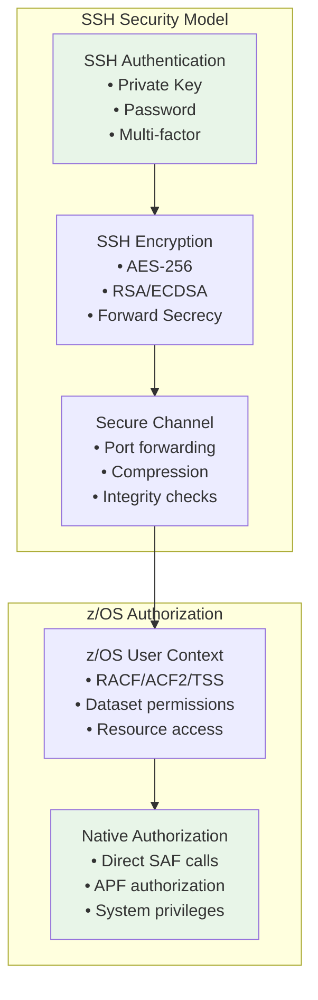

### z/OSMF REST API

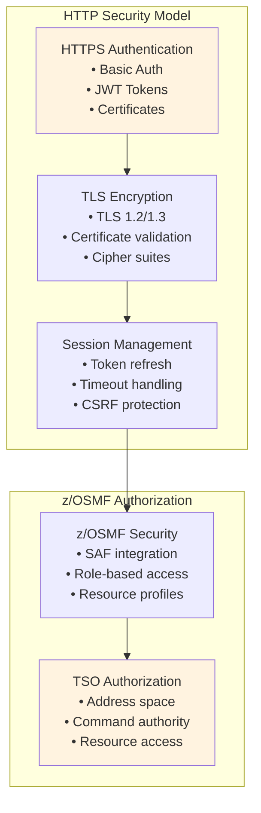

## Use Cases

### High-frequency operations

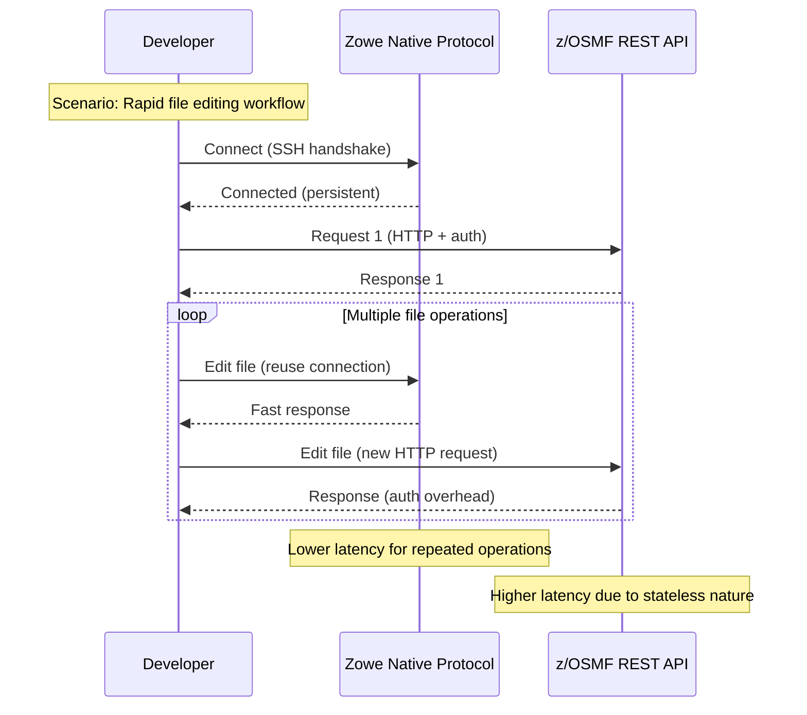

### Large data transfer

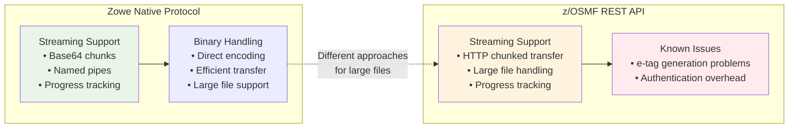
