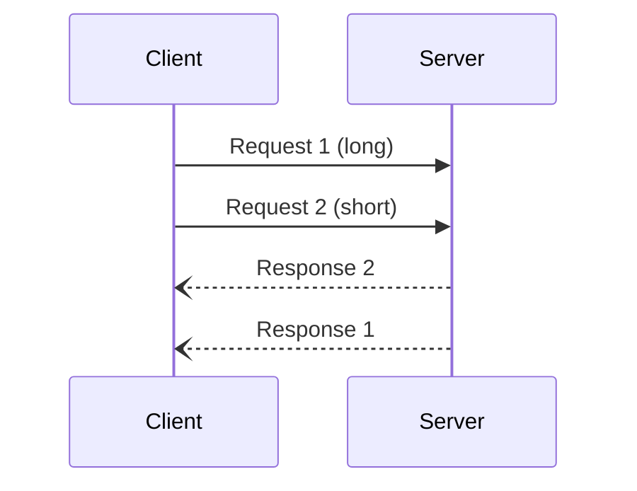

# JSON-RPC SSH Demo

Demonstrates a JSON-RPC 2.0 server over SSH using `zjson` for struct serialization,
following the same pattern as the zowed backend (see `native/c/server/rpcio.hpp`).

## Server

- Upload: `zowe files upload ftu server.cpp <ussDir>/server.cpp --binary`
- Build on z/OS: `g++ -std=c++17 -I../../native/c -o jsonrpc-server server.cpp`

## Client

- `cd examples/jsonrpc-ssh && npm install` (once)
- `npx tsx client.ts ibmuser@<zosHost> <serverCmd>`
  - `zosHost` - hostname of z/OS server
  - `serverCmd` - command to run the compiled binary
