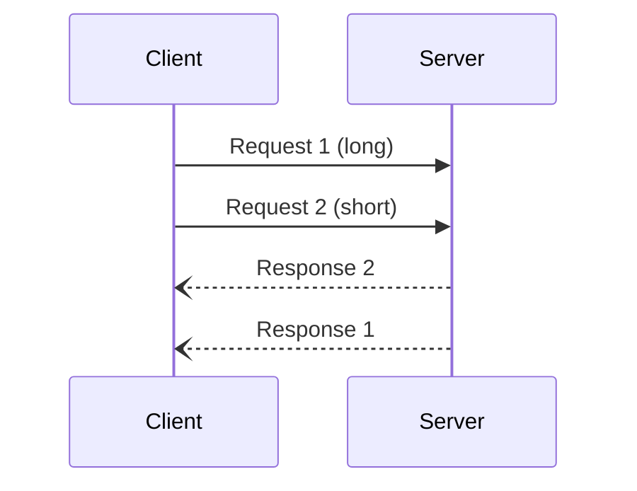

# JSON-RPC SSH Demo

Demonstrates a JSON-RPC 2.0 server over SSH using `zjson` for struct serialization,
following the same pattern as the zowed backend (see `native/c/server/rpcio.hpp`).



## Deploy & Build

Requires the native backend to be deployed first (the `zjson.hpp` headers must
exist at `<deploy-dir>/c/`).

```bash
npx tsx examples/deploy.ts <ssh-profile> <deploy-dir> jsonrpc-ssh
```

## Client

```bash
cd examples/jsonrpc-ssh && npm install
npx tsx client.ts <user>@<host> <deploy-dir>/examples/jsonrpc-ssh/server
```
