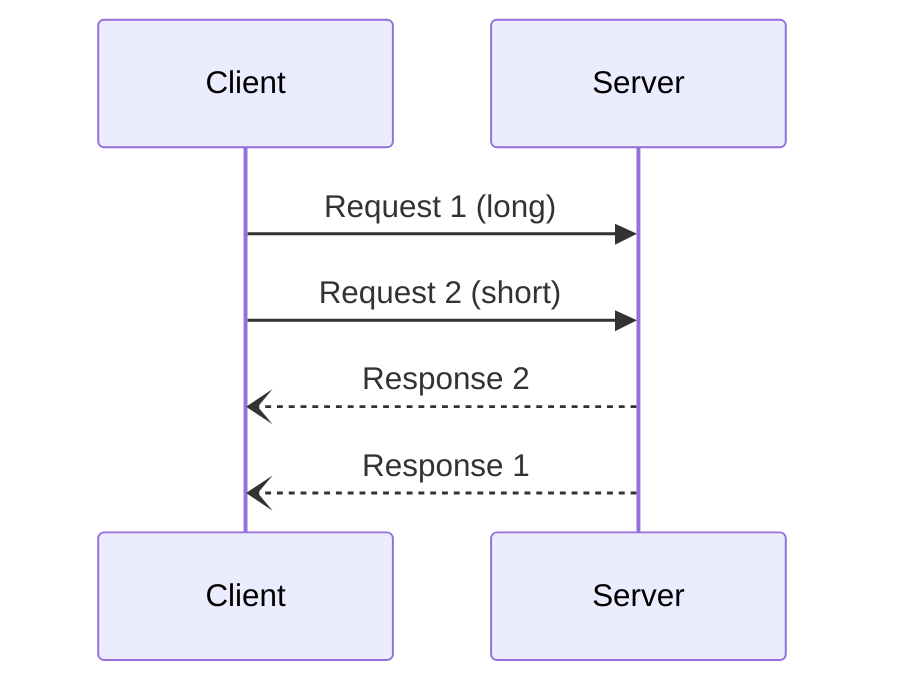

# JsonRPC SSH Demo

## Server

* `zowe files upload dtu tools/jsonrpc-ssh <ussDir> --binary`
* `go build -o jsonrpc-server jsonrpc.go` (on z/OS)

## Client

* `cd tools/jsonrpc-ssh && npm install` (once)
* `npx tsx client.ts ibmuser@<zosHost> <serverCmd>`
  * `zosHost` - hostname of z/OS server
  * `serverCmd` - command to run Go binary
